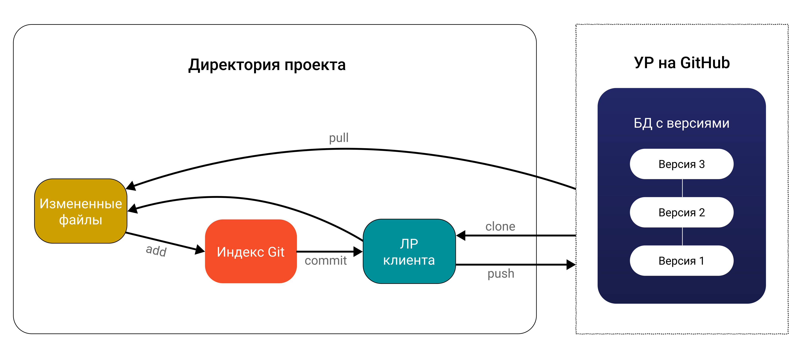
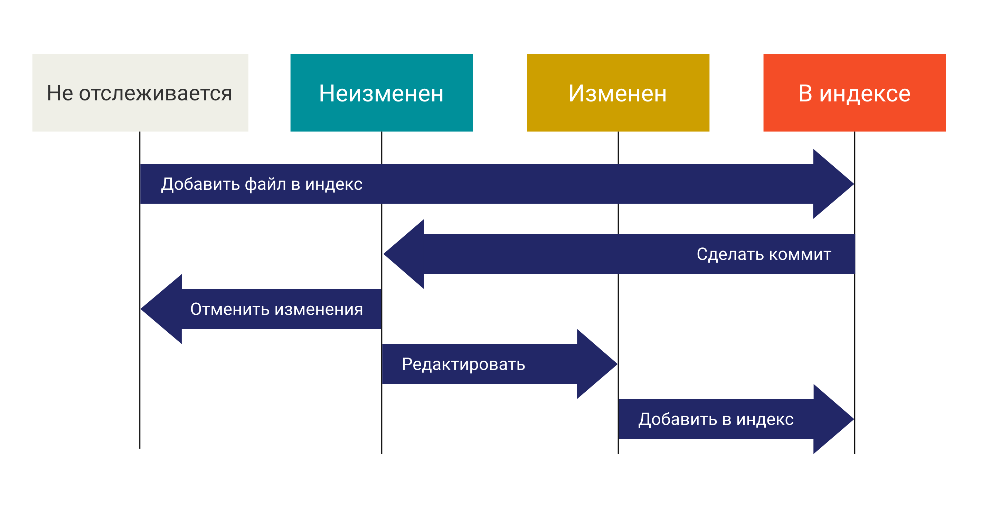

[< к содержанию](./readme.md)

## Графические схемы  

**Схема 1** — процесс работы с Git

**Схема 2** — состояние файлов в репозитории

+ ***не отслеживаемые (untracked) — находящиеся в ЛР, но еще не добавленные в индекс (под версионный контроль)***

+ ***индексированные (staged) — новые файлы, добавленные впервые в индекс***

+ ***зафиксированные (committed) — попавшие в коммит***

+ ***измененные (modified) — модифицированные после коммита***
